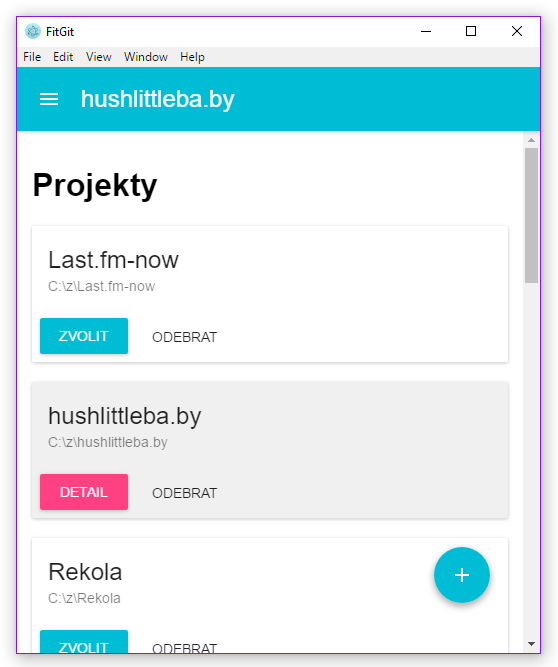

# FitGit

[](https://travis-ci.org/Onset/git-latex)
[](https://ci.appveyor.com/project/Onset/git-latex)
[](https://david-dm.org/Onset/git-latex)



Git UI client featuring notifications about new updates in your git repository.

## Development

Install [Node.js](https://nodejs.org/) and then

```bash
$ npm install
```

### Run

```bash
$ npm start
```

### Build

```bash
$ npm run build
```

## Requirements

- Windows
	- [Git client](https://git-scm.com/download/win)
	- For https repositories: [Credential Storage](https://git-scm.com/book/gr/v2/Git-Tools-Credential-Storage) enabled (`git config --global credential.helper`)
	- For ssh: [Pageant](https://winscp.net/eng/docs/ui_pageant) configured

- Linux
	- Git client
	- For https repositories: [Credential Storage](https://git-scm.com/book/gr/v2/Git-Tools-Credential-Storage) enabled (`git config --global credential.helper`)
